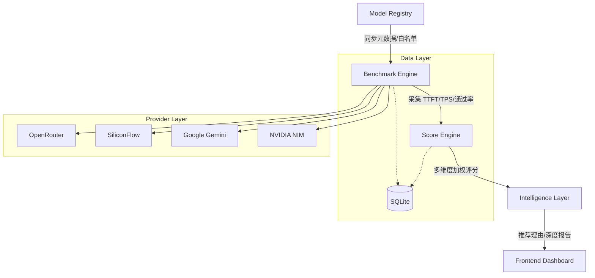

# LLM Model Benchmark Studio 🚀

[](LICENSE)
[](https://www.python.org/)
[](https://fastapi.tiangolo.com/)
[](https://reactjs.org/)

**LLM Model Benchmark Studio** 是一个专业的大语言模型 (LLM) 性能测试、能力评估与智能推荐平台。它旨在解决模型爆炸时代下，开发者面对数百个模型（尤其是免费模型）时，因缺乏客观数据而导致的“选择困难”问题。

通过构建一套从 **模型注册 $\rightarrow$ 性能基准 $\rightarrow$ 能力评估 $\rightarrow$ 智能评分** 的完整闭环，本项目将模型能力从“厂商宣称”转化为“真实可测”的量化指标。

---

## 🌟 核心价值

在面对 OpenRouter 等聚合平台提供的数百个模型时，本项目提供以下能力：

- **🛡️ 安全的免费模型导航**：建立严格的本地白名单校验机制，确保测试仅针对标记为 `free` 的模型，规避意外扣费风险。
- **⚡ 毫秒级性能量化**：真实采集 **TTFT (首字延迟)**、**TPS (吞吐量)** 和 **Total Latency**，揭示模型在真实交互中的流畅度。
- **🧠 多维度能力验证**：通过定制化的任务集 (Coding, Reasoning, Structured Output) 验证模型的实际智力水平。
- **🎯 任务导向的智能推荐**：不再是单一的排行榜，而是根据不同任务 Profile (如 `Coding`, `Chat`) 动态计算得分并推荐最适配模型。

---

## 🏗️ 系统架构

项目采用前后端分离架构，核心逻辑分为四个层级：



### 核心模块
- **Model Registry**: 统一管理模型 ID、Context Window 及免费状态。
- **Benchmark Engine**: 基于 `asyncio` 的高并发测试流水线，支持流式输出采集。
- **Score Engine**: 将原始指标通过归一化算法转化为 $[0, 100]$ 的竞争力分数。
- **Intelligence Layer**: 提供基于证据链的模型分析报告和推荐建议。

---

## 🛠️ 快速启动

### 1. 环境准备
- Python 3.10+
- Node.js 18+ & npm
- Docker & Docker Compose (可选)

### 2. 后端启动
```bash
cd backend
cp .env.example .env
# 编辑 .env 配置 ADMIN_TOKEN 和 Provider API Key
python3 -m venv .venv
source .venv/bin/activate
pip install -r requirements.txt
uvicorn app.main:app --reload
```

### 3. 前端启动
```bash
cd frontend
npm install
npm run dev
```

### 4. Docker 一键部署
```bash
cp backend/.env.example backend/.env
docker compose up --build
```
访问 `http://localhost:5173` 即可进入评测工作台。

---

## 🔑 API 契约 (管理接口)

所有管理类接口（同步模型、启动测试）均需在请求头中携带 `X-Admin-Token`。

| 方法 | 路径 | 说明 | 权限 |
| :--- | :--- | :--- | :--- |
| `GET` | `/api/models/sync` | 同步服务商模型目录 | `Admin` |
| `POST` | `/api/benchmark/run` | 启动性能基准测试 | `Admin` |
| `POST` | `/api/capabilities/benchmark` | 启动能力维度评测 | `Admin` |
| `GET` | `/api/leaderboard` | 获取综合评分排行榜 | `Public` |
| `GET` | `/api/recommend` | 根据任务推荐模型 | `Public` |

---

## 📈 路线图 (Roadmap)

- [x] **V1.0 Core**: 基础适配器、性能采集、基础评分 $\checkmark$
- [x] **V1.1 Intelligence**: 智能分析报告、任务导向推荐 $\checkmark$
- [ ] **V1.2 Expansion**: 增加更多 Provider 原生适配、多模态能力评测。
- [ ] **V2.0 Ecosystem**: 引入社区驱动的任务集、实时监控看板、本地模型 (Ollama) 集成。

---

## 📄 License
Distributed under the MIT License. See `LICENSE` for more information.
